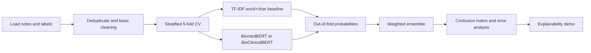
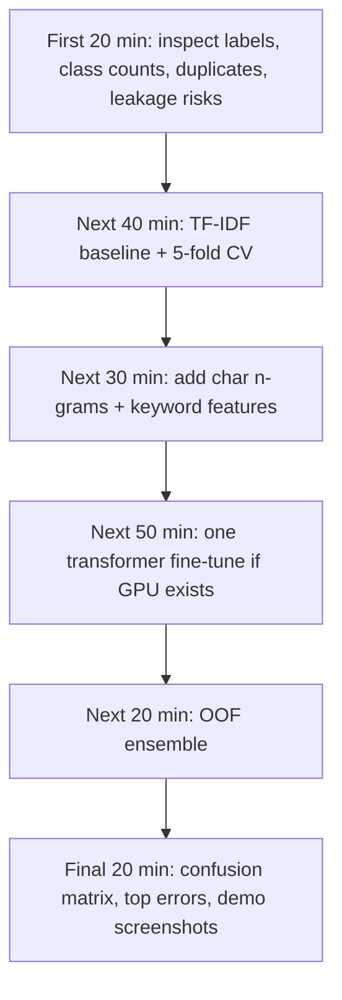

# Clinical Note Classification for the Hackathon

## Executive Summary

Your task is a small-data, five-class clinical text classification problem with a hidden test set. In this setting, the highest-probability path is **not** to start with a heavyweight model. A **strong lexical baseline** such as **TF-IDF plus logistic regression or linear SVM** should be your first serious submission, because recent medical-note classification studies still show classical models remaining competitive and computationally efficient on related multiclass tasks, while transformer fine-tuning on small biomedical datasets is often unstable unless tuned carefully. citeturn5view0turn5view3turn32view0turn36view0

The most practical rank order for this hackathon is: **first, TF-IDF word and character n-grams with a linear classifier; second, one domain-specific encoder model such as PubMedBERT or BioClinicalBERT if you have a GPU; third, a simple ensemble of the classical and transformer models; fourth, a lightweight explainability layer for demo value**. Official biomedical benchmark signals and recent clinical NLP studies both favor **domain-specific pretraining** over generic language models, but they also show that **continued pretraining** adds real compute cost for only modest gains and that **few-shot prompting** is usually not the best route once labeled data is available. citeturn11view0turn11view1turn37view0turn4view3turn7view0turn36view0turn18search0

Data augmentation is worth treating as a **secondary lever**, not the main strategy. Recent healthcare NLP work suggests that **targeted, clinically aware augmentation** can help, and that **GPT-4-style augmentation** may improve downstream supervised models in some settings, but naive LLM annotation or augmentation can also hurt, and broader synthetic-data reviews emphasize that factuality and privacy validation remain unresolved. In other words: use augmentation only after you already have a stable baseline. citeturn26search21turn30view0turn21view0turn28view0

My bottom-line recommendation for a three-hour hackathon is blunt: **ship a very strong TF-IDF baseline first, then fine-tune exactly one biomedical/clinical encoder, then ensemble them if the encoder genuinely adds cross-validated lift**. Anything more exotic than that is probably wasted effort in the time you have. citeturn5view0turn32view0turn7view0turn36view0

## Task Restatement and Dataset Constraints

From the challenge sheet you shared, the problem is to assign each short clinical note to exactly one of five labels: **Cardiology, Neurology, Orthopedics, Gastroenterology, or Other**. The training set is only **about 1,000 notes**, scoring is done on a **hidden test set**, and the context is an explicitly **time-limited hackathon**. That combination strongly favors methods that generalize well under small-sample conditions and can be cross-validated quickly.

There are close public analogs. Kaggle has hosted note-routing competitions with essentially the same structure, including five-way medical-note classification tasks, and the widely used **Medical Transcriptions** dataset has also become a common public sandbox for specialty classification experiments. That is useful because it means the task is well within standard NLP practice; it is not a frontier research problem, so boringly solid baselines matter more than novelty. citeturn29search0turn29search6turn29search9turn3search2

The key constraint is not model capacity. It is **sample efficiency under hidden evaluation**. With only ~1,000 notes, every decision that increases variance or overfitting risk is dangerous. That is why cross-validation design, label leakage prevention, and conservative feature engineering matter more here than architectural cleverness.

## Prioritized Research Questions

The recent literature makes the following questions the ones that actually matter for your decision-making:

1. **Which model family is strongest on small medical text datasets: classical linear models, fine-tuned domain-specific transformers, or hybrids?**
2. **How much real lift does domain-specific transfer learning provide over TF-IDF baselines once the labeled set is only around 1,000 notes?**
3. **Which augmentation methods help without corrupting specialty labels?**
4. **Which cheap feature engineering steps add signal fast: keyword scores, character n-grams, entity counts, section cues, or note metadata?**
5. **Which internal evaluation setup is most predictive of hidden-test performance: accuracy, macro-F1, repeated stratified CV, calibration, or error analysis by class?**
6. **What explainability methods are demo-friendly without being misleading?** citeturn7view0turn21view0

## What the Recent Evidence Says

Recent work does **not** support the lazy assumption that transformers automatically dominate. On a 20-class medical transcription classification study using 4,324 records, **TF-IDF plus logistic regression reached 0.89 accuracy and 0.88 F1**, while the best overall configuration in that paper was **Word2Vec plus k-NN at 0.92 accuracy**. On a more recent four-class medical-note study using 9,633 labeled notes, **logistic regression was the top classical model at 0.83 accuracy** with TF-IDF features. These are not perfectly matched to your five-class specialty setup, but they are close enough to show that **classical baselines are still very credible on medical note classification**, especially when the problem is lexically distinctive and compute is limited. citeturn5view0turn5view3turn32view0

Hybrid feature pipelines are also a real signal, not hype. In a 2023 study on automatic medical specialty classification from symptom descriptions, a hybrid model combining **TF-IDF, BERT, LSTM, and TextCNN** reached **93.5% accuracy**, outperforming plain BERT at **90.5%**. In a 2025 specialty-prediction study, **Entity-enhanced BERT** improved over the BERT baseline by about **2.1 points in precision, 2.7 in recall, and 2.6 in macro-F1**, and the authors explicitly used **macro-F1 and MCC** because of class imbalance and nested cross-validation. The practical implication is simple: **cheap specialty-specific features can still move the needle even when you already have a transformer**. citeturn17view1turn16view0turn16view1turn16view3turn38view0

Domain-specific encoders still matter. **BiomedBERT** was pretrained from scratch on **PubMed and PubMed Central** and, at release, held the top **BLURB** benchmark score. **BioClinicalBERT** extends biomedical pretraining with **all MIMIC-III notes**, about **880 million words**, and remains one of the most practical off-the-shelf clinical encoders. But there is a catch: the biomedical fine-tuning literature shows that with **small labeled datasets**, larger neural models become **more unstable**, and performance can be sensitive to pretraining details. The strongest practical stabilization findings are that **freezing lower layers helps BERT-base models**, while **layer-wise learning-rate decay** is more helpful for larger models; domain-specific vocabulary and in-domain pretraining make fine-tuning more robust overall. citeturn37view0turn11view0turn11view1turn4view3turn36view0

Continued pretraining is usually the wrong bet for a hackathon. A 2025 study on clinical NLP under restricted data availability found that **clinical-specific PLMs were the best baselines**, that **continued pretraining on local clinical text did improve performance**, but that the gain was **marginal relative to the compute cost**. In that study, continued pretraining added roughly **9.75 extra GPU hours** per model on a single **RTX 4090**, and the authors explicitly recommended plain fine-tuning as the more practical option when resources are constrained. That same study also found that **prompt-and-predict underperformed fine-tuned PLMs**, even with few-shot examples, and only became attractive when no labeled data was available at all. citeturn7view0turn6view2turn6view3turn6view4turn6view1

Few-shot LLM prompting is therefore not where I would try to win. The negative case is strong: **GPT-3 was shown to be a poor few-shot learner in the biomedical domain** relative to smaller domain-pretrained models, and the 2025 restricted-data clinical study reached the same broader conclusion. The positive case is narrower: a 2025 JAMIA paper on **dynamic few-shot clinical note section classification** showed that retrieval-based exemplar selection can substantially improve prompting, with average **macro-F1 gains of 39.3% over zero-shot and 21.1% over static few-shot prompting** across the evaluated LLMs. That is meaningful, but it is better interpreted as evidence that prompt engineering can become respectable when carefully designed, not as evidence that prompting is the best primary solution for your labeled five-class hackathon. citeturn18search0turn6view1turn20view0

On augmentation, the useful signal is again narrower than people assume. A 2024 medical text study proposed **Contextual Random Replacement** and **Targeted Entity Random Replacement** specifically for data scarcity and imbalance, while a 2024 JAMIA study on health-related text classification found that **GPT-4-based augmentation** could help supervised classifiers, whereas **GPT-3.5-only annotation** was ineffective and GPT-3.5 augmentation could even degrade performance. A 2026 scoping review of biomedical synthetic data generation concluded that synthetic text is increasingly used to address **data scarcity and privacy limitations**, but that **factual accuracy, fidelity assessment, and privacy testing** remain major unresolved issues. So the practical rule is: **augment minority classes carefully and validate aggressively; do not mass-generate paraphrases and assume they help**. citeturn26search21turn30view0turn28view0turn21view0

Explainability is worth doing, but not with fake confidence. Recent medical NLP explainability work argues that **attention-only explanations are often not faithful**, can highlight irrelevant tokens, and should not be treated as sufficient evidence of the model’s reasoning. In an EMNLP 2024 paper, the authors argued for more faithful attribution methods than standard attention-based explanations; in another EMNLP 2024 paper on medical coding, the authors showed that current interpretability efforts often over-rely on label attention and can highlight medically irrelevant tokens. For a hackathon demo, the right move is to use **faithfulness-oriented token attributions for transformers** and **coefficients / SHAP-like feature contributions for linear models**, not raw attention heatmaps alone. citeturn23view1turn24view1turn24view2turn24view3turn24view4turn23view0

## Candidate Approaches and Practical Benchmarks

The most relevant public benchmark signal for model choice is the **BLURB** ecosystem, where biomedical-domain encoders such as **BiomedBERT** have led official benchmark scores, while Kaggle-style medical-note competitions confirm that five-way specialty routing is a standard classification pattern rather than a highly specialized task. The big caveat is that there is **no exact public benchmark matching your precise five labels, note style, and hidden test**, so the performance ranges below are **pragmatic estimates inferred from related studies**, not results directly reported on your exact dataset. citeturn11view0turn37view0turn29search0turn29search6

| Approach | Expected macro-F1 / accuracy on your task | Training time | Compute needs | Augmentation suitability | Pros / cons | Recommended starting hyperparameters | Evidence basis |
|---|---:|---|---|---|---|---|---|
| **TF-IDF + Logistic Regression / Linear SVM** | **~0.84–0.91** | Seconds to a few minutes | Laptop CPU is enough | Low to moderate; usually less important than better features and CV discipline | **Pros:** fastest, reproducible, interpretable, hard to overfit catastrophically. **Cons:** weaker semantic generalization, may struggle on ambiguous “Other” notes. | Word n-grams `(1,2)` or `(1,3)`; char-wb n-grams `(3,5)`; `min_df=2`; `sublinear_tf=True`; `C` in `1–4`; `class_weight="balanced"`; `max_iter>=5000`. | Range inferred from related note tasks where TF-IDF + LR reached **0.89 accuracy / 0.88 F1** on 20 classes and **0.83 accuracy** on a four-class note dataset. citeturn5view0turn5view3turn32view0 |
| **BioClinicalBERT or BiomedBERT fine-tuning** | **~0.88–0.94** if stable | Roughly minutes per run; longer with CV | One consumer GPU strongly preferred | Moderate; use sparingly and mainly for minority classes | **Pros:** best chance of beating lexical baseline if signal is subtle; domain-specific vocabulary matters. **Cons:** instability on small data; slower iteration; can lose to a strong linear baseline if tuning is poor. | Start with `lr=2e-5`, batch `8–16`, `3–5` epochs, `weight_decay=0.01`, `warmup_ratio=0.1`, `max_length=128–256`, early stopping on macro-F1; if unstable, freeze lower layers or reduce LR. | Domain-specific encoders are strong on BLURB and clinical tasks; BioClinicalBERT uses all MIMIC notes; small-data fine-tuning instability is well documented. citeturn37view0turn4view3turn11view0turn36view0 |
| **Continued pretraining / deeper domain adaptation** | **Potentially +0.5 to +2.5 points** over plain fine-tune, but not guaranteed | Hours, not minutes | Strong GPU and extra unlabeled text | Less important than access to in-domain unlabeled notes | **Pros:** best fit if you already have a sizable unlabeled corpus from the same source. **Cons:** poor hackathon ROI; extra complexity and time. | Only if you have many unlabeled notes: continue MLM pretraining briefly, then fine-tune normally for `3–5` epochs. | Clinical-specific PLMs were best; continued pretraining helped, but one study reported only marginal practical gains relative to ~**9.75 extra GPU hours**. citeturn7view0turn6view4 |
| **Hybrid keyword + ML / entity + ML** | **~0.87–0.93** | Minutes | CPU, optionally one GPU if combined with encoder | Moderate; safer to add feature channels than to flood with synthetic notes | **Pros:** often best time/performance trade-off; easy to explain; can rescue rare cues. **Cons:** needs disciplined feature design to avoid leakage. | Add fold-derived specialty keyword scores, entity counts, note-length features, and optional transformer probabilities into a linear meta-classifier. | Hybrid and entity-enhanced models beat plain BERT in recent specialty-prediction studies. citeturn17view1turn16view0turn16view1turn16view3 |
| **Few-shot LLM prompting** | **~0.55–0.80** as a practical baseline, occasionally higher with retrieval-style prompting | No training; slow inference | API access or local 7B+ model | High for augmentation / annotation support; lower as final classifier | **Pros:** fastest demo, natural-language explanations, useful when no labels exist. **Cons:** inconsistent, costly or slow, weaker than fine-tuned PLMs once labels are available. | Constrain output to exact labels; use `5–10` retrieved exemplars max; low temperature; strict parser. | Biomedical few-shot prompting often underperforms fine-tuned models, though dynamic exemplar retrieval can beat zero-shot and static prompting substantially. citeturn18search0turn6view1turn20view0turn30view0 |

The single most realistic winning stack is therefore **TF-IDF + LR/SVM as the anchor**, **one domain-specific encoder as the upside play**, and **a small probability-level ensemble** if the encoder adds real out-of-fold lift. That recommendation is the most consistent with the literature and the time constraint. citeturn5view0turn32view0turn17view1turn7view0

## Reproducible Baselines and a Three-Hour Hackathon Plan

Use this workflow. Do not improvise beyond it unless the data tells you to.



The baseline evaluation protocol should be **stratified 5-fold cross-validation**, with the **same folds for every model**, and **macro-F1** as the primary model-selection metric. Accuracy and weighted-F1 should still be tracked, but macro-F1 is the safer default because recent specialty-prediction work explicitly used macro-F1 and MCC to cope with imbalance, and recent clinical NLP recommendation work also reports macro-F1 as the key cross-task measure. If you have time, repeat the transformer run over **three random seeds** and average the scores; variance is a real issue in small-data biomedical fine-tuning. citeturn16view3turn38view0turn6view3turn36view0

A good classical baseline recipe is below. Keep preprocessing light. Clean obvious junk, normalize whitespace, and consider lemmatization if your data is noisy, but do **not** spend your time on elaborate text normalization that risks deleting specialty cues.

```python
from sklearn.pipeline import FeatureUnion, Pipeline
from sklearn.feature_extraction.text import TfidfVectorizer
from sklearn.linear_model import LogisticRegression
from sklearn.calibration import CalibratedClassifierCV
from sklearn.model_selection import StratifiedKFold, cross_val_predict
from sklearn.metrics import f1_score
import numpy as np

word_tfidf = TfidfVectorizer(
    analyzer="word",
    ngram_range=(1, 2),
    min_df=2,
    max_df=0.95,
    sublinear_tf=True,
)

char_tfidf = TfidfVectorizer(
    analyzer="char_wb",
    ngram_range=(3, 5),
    min_df=2,
    sublinear_tf=True,
)

features = FeatureUnion([
    ("word", word_tfidf),
    ("char", char_tfidf),
])

base_lr = LogisticRegression(
    C=2.0,
    class_weight="balanced",
    max_iter=5000,
    solver="saga",
    multi_class="multinomial",
)

clf = Pipeline([
    ("tfidf", features),
    ("lr", base_lr),
])

cv = StratifiedKFold(n_splits=5, shuffle=True, random_state=42)

# OOF probabilities for robust model selection / ensembling
oof_pred = cross_val_predict(clf, texts, y, cv=cv, method="predict")
macro_f1 = f1_score(y, oof_pred, average="macro")
print("Baseline macro-F1:", macro_f1)
```

Add **three cheap feature-engineering channels** before you try exotic augmentation. First, compute **fold-specific specialty keyword scores** from the training fold only, for example by taking top positive coefficients from one-vs-rest logistic models and turning them into class-count or class-weighted features. Second, add a few **rule-like counts** for specialty procedures, imaging terms, or body-region terms if they emerge clearly in the data. Third, add **note length and digit/procedure density** features. These are exactly the kind of shallow-plus-contextual combinations that helped recent hybrid and entity-enhanced specialty classification work. citeturn17view1turn16view0turn16view6

If you have even one decent GPU, run exactly one transformer baseline. Use **BiomedBERT** first if your notes look more like general medical prose; use **BioClinicalBERT** first if they read like note-style clinical narratives. Do not continue pretraining. Do not tune five models. One clean run is enough.

```python
from transformers import (
    AutoTokenizer,
    AutoModelForSequenceClassification,
    TrainingArguments,
    Trainer
)

model_name = "microsoft/BiomedNLP-BiomedBERT-base-uncased-abstract-fulltext"
# alternative: "emilyalsentzer/Bio_ClinicalBERT"

tokenizer = AutoTokenizer.from_pretrained(model_name)
model = AutoModelForSequenceClassification.from_pretrained(model_name, num_labels=5)

def tokenize(batch):
    return tokenizer(
        batch["text"],
        truncation=True,
        padding="max_length",
        max_length=192,
    )

args = TrainingArguments(
    output_dir="./runs/biomedbert_cls",
    learning_rate=2e-5,
    per_device_train_batch_size=8,
    per_device_eval_batch_size=16,
    num_train_epochs=5,
    weight_decay=0.01,
    warmup_ratio=0.1,
    evaluation_strategy="epoch",
    save_strategy="epoch",
    load_best_model_at_end=True,
    metric_for_best_model="macro_f1",
    fp16=True,
    report_to="none",
)
```

For the transformer, the practical starting rule is: **low learning rate, small batch, short notes, early stopping, macro-F1 monitoring**. If the run is unstable, drop the learning rate, reduce max length, or freeze the lower layers. That advice is consistent with the biomedical fine-tuning stability literature and with recent specialty-prediction experiments that validated on macro-F1 and used small batch sizes on a single GPU. citeturn36view0turn38view0

Your ensemble should be simple. Use **out-of-fold predicted probabilities** from the TF-IDF model and the transformer, then either average them or train a tiny meta-classifier on the OOF outputs. Start with a fixed average such as:

```python
p_final = 0.6 * p_tfidf + 0.4 * p_bert
```

Then tune the weight on your validation folds only. If the transformer gives no stable lift, kill it. A worse ensemble is still worse. Hybrid evidence from the specialty-classification literature supports combining shallow and deep signals, but only when each component adds independent information. citeturn17view1turn16view0

For a **three-hour hackathon**, the quickest useful time allocation looks like this:



The highest-ROI quick wins are straightforward. First, **deduplicate near-identical notes** and look for label noise. Second, **get the TF-IDF baseline done early**, because it gives you a real score anchor quickly. Third, **add char n-grams and keyword scores** before trying augmentation. Fourth, **fine-tune only one domain-specific encoder** if compute permits. Fifth, **ensemble only if cross-validation says it helps**. These steps align best with the evidence base on small clinical text datasets and with the compute tradeoffs reported in recent clinical NLP studies. citeturn5view0turn32view0turn7view0turn36view0

For optional demo features, the strongest low-risk additions are: a **top-2 specialty prediction with confidence**, a **highlighted evidence span view**, a **per-class keyword panel** for the linear model, and **token attribution** for the transformer using a faithfulness-oriented method such as integrated-gradients-style attribution rather than raw attention alone. Recent medical NLP explainability work explicitly warns against treating attention heatmaps as sufficient explanations. citeturn23view0turn23view1turn24view1turn24view2turn24view3

## Open Questions and Limitations

The biggest unknown is the **actual scoring metric**. If the organizers score pure accuracy, a model that is slightly less balanced but more calibrated on the dominant classes may win; if they care about macro-F1, the “Other” class and minority specialties become much more important. Because the metric is unspecified, you should track **both accuracy and macro-F1** internally, but optimize your model choices primarily on macro-F1 unless you learn otherwise. citeturn16view3turn6view3

The second unknown is **dataset provenance**. Public evidence comes from medical transcriptions, symptom descriptions, general biomedical benchmarks, and some note-style clinical corpora, but not from your exact hidden-test set. So the performance ranges in this report are **well-grounded but still approximate**. The practical implication is that your **cross-validation results on your own folds** matter more than any paper’s headline score. citeturn29search0turn3search2turn11view0turn7view0

The final limitation is that newer encoders such as long-context clinical models are emerging quickly, but for this hackathon they are mostly **interesting, not necessary**. The evidence you need to act on right now is already clear enough: **strong lexical baseline first, one domain-specific encoder second, simple ensemble third, explainability last**. citeturn31view0turn31view1turn7view0